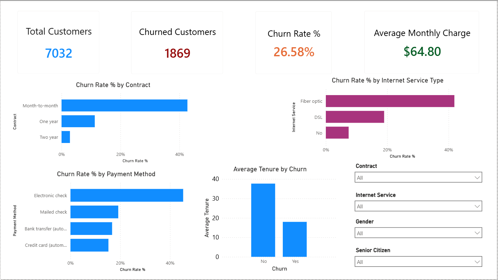

# Customer Churn Analysis

An end-to-end business-focused data analysis project exploring customer churn patterns, identifying high-risk customer segments, and presenting actionable retention insights through Python, SQL, and Power BI.

---

## Project Overview

Customer churn is a critical business challenge because retaining existing customers is often more cost-effective than acquiring new ones.

This project analyzes customer churn behavior to identify key factors influencing customer attrition and uncover opportunities for improving retention strategies.

The workflow includes:

- Data cleaning and exploratory analysis in Python
- Business analysis using SQL (SQLite)
- Executive dashboard development in Power BI
- Business storytelling and actionable insights

---

## Dashboard Preview



---

## Business Objective

The goal of this project is to answer key business questions such as:

- What is the overall churn rate?
- Which customer segments are most likely to churn?
- Does contract type influence retention?
- Does internet service type impact churn behavior?
- Are certain payment methods associated with higher churn?
- Do churned customers differ in tenure compared to retained customers?

---

## Dataset

**Dataset:** Telco Customer Churn Dataset

The dataset contains customer account information, subscription details, billing information, and churn status.

Key features include:

- Customer demographics
- Contract type
- Internet service type
- Payment method
- Monthly charges
- Total charges
- Customer tenure
- Churn status

---

## Tech Stack

**Programming & Analysis**
- Python
- Pandas
- Matplotlib

**Database / Querying**
- SQLite
- SQL

**Business Intelligence**
- Power BI

**Development Tools**
- Jupyter Notebook
- VS Code

---

## Project Workflow

### 1. Data Cleaning & Preparation (Python)

Performed data preprocessing including:

- Loaded raw customer churn dataset
- Inspected data structure and feature types
- Converted `TotalCharges` to numeric format
- Handled missing values
- Exported cleaned dataset for downstream analysis

---

### 2. Exploratory Data Analysis (Python)

Analyzed churn patterns through visual exploration:

- Customer churn distribution
- Churn rate by contract type
- Churn rate by internet service
- Churn rate by payment method
- Average tenure comparison
- Average monthly charge comparison

---

### 3. Business Analysis (SQL)

Used SQL queries to answer business-focused questions:

- Total customers
- Total churned customers
- Churn percentage
- Churn rate by contract type
- Churn rate by internet service
- Churn rate by payment method
- Average tenure by churn status
- Average monthly charges by churn status
- High-risk customer segment analysis

Example business logic used:

```sql
SUM(CASE WHEN Churn = 'Yes' THEN 1 ELSE 0 END)
```

---

### 4. Executive Dashboard (Power BI)

Built a business-oriented dashboard to support executive decision-making.

Dashboard includes:

**KPIs**
- Total Customers
- Churned Customers
- Churn Rate %
- Average Monthly Charge

**Visual Insights**
- Churn Rate by Contract Type
- Churn Rate by Internet Service
- Churn Rate by Payment Method
- Average Tenure by Churn

**Interactive Filters**
- Contract
- Internet Service
- Gender
- Senior Citizen

---

## Key Business Insights

### 1. High Overall Churn Rate

- Overall churn rate is **26.58%**
- More than 1 in 4 customers have churned

Business implication:
Retention initiatives should be a strategic priority.

---

### 2. Month-to-Month Customers Are Highest Risk

Customers with month-to-month contracts show significantly higher churn compared to longer-term contracts.

Business implication:
Longer contract incentives may improve retention.

---

### 3. Fiber Optic Customers Churn More

Customers using fiber optic internet services show elevated churn rates.

Business implication:
Possible dissatisfaction with pricing, service quality, or customer expectations.

---

### 4. Electronic Check Customers Show Higher Churn

Payment method appears associated with churn behavior.

Business implication:
Billing experience or customer segment behavior may influence retention.

---

### 5. Churned Customers Have Lower Tenure

Customers who churn tend to leave earlier in their lifecycle.

Business implication:
Early customer engagement and onboarding may reduce churn risk.

---

## Project Structure

```bash
TELCO_CUSTOMER_CHURN/
│
├── dashboard/
│   └── customer_churn_dashboard.pbix
│
├── data/
│   ├── customer_churn_data.csv
│   ├── churn_cleaned.csv
│   └── customer_churn.db
│
├── images/
│   ├── churn_by_contract.png
│   ├── churn_by_internet_service.png
│   ├── churn_by_payment_method.png
│   ├── churn_rate_by_senior_citizen.png
│   ├── customer_churn_dashboard.png
│   ├── monthly_charge_by_churn.png
│   └── tenure_by_churn.png
│
├── notebooks/
│   └── churn_analysis.ipynb
│
├── sql/
│   └── churn_analysis.sql
│
├── README.md
├── .gitignore
└── requirements.txt
```

---

## How to Run

### Clone repository

```bash
git clone https://github.com/Rupesh1Khanal/customer-churn-analysis.git
```

---

### Create virtual environment

```bash
python -m venv churn_env
```

Activate:

**Windows**
```bash
churn_env\Scripts\activate
```

---

### Install dependencies

```bash
pip install -r requirements.txt
```

---

### Run notebook

Open:

```text
notebooks/churn_analysis.ipynb
```

---

## Future Improvements

Potential next steps:

- Build churn prediction machine learning models
- Add customer segmentation analysis
- Perform cohort retention analysis
- Add advanced DAX metrics in Power BI
- Compare churn behavior across demographic groups

---

## Author

Built as a business-focused data analysis portfolio project for Data Analyst / BI roles.